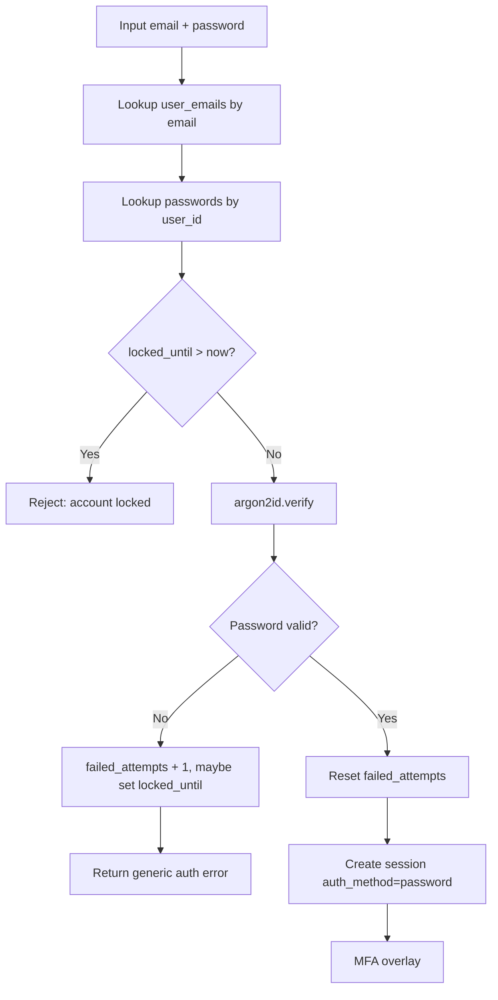
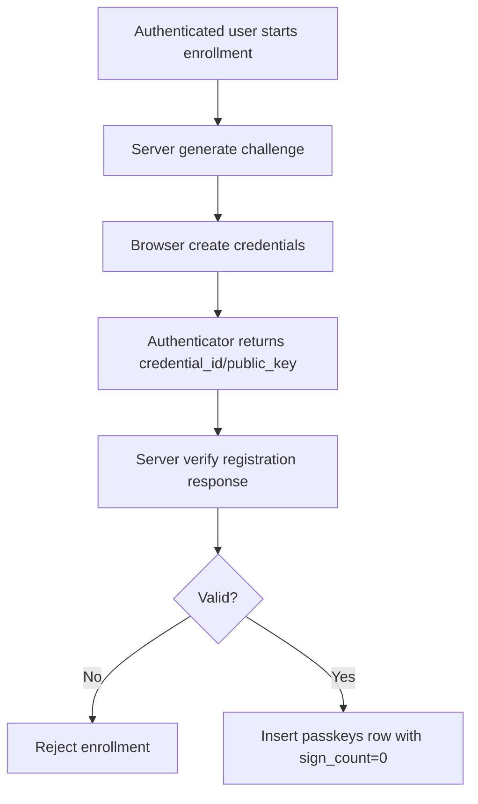
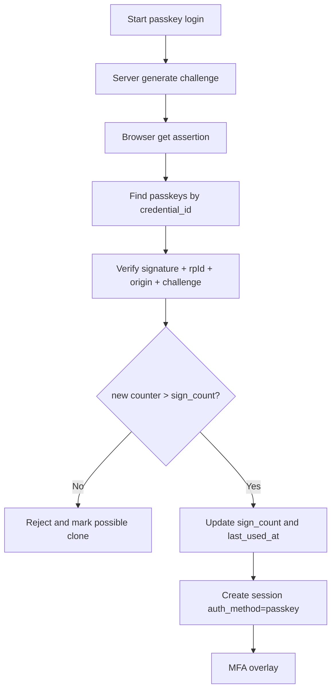
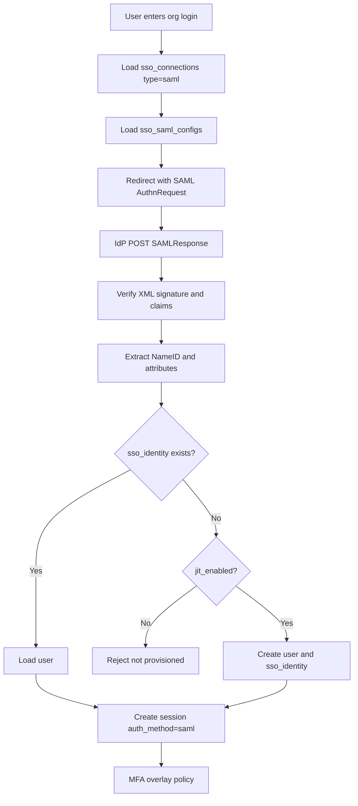
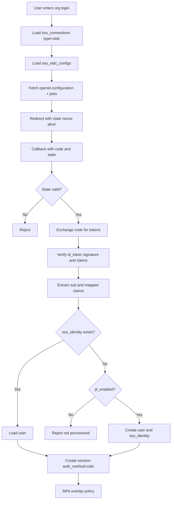
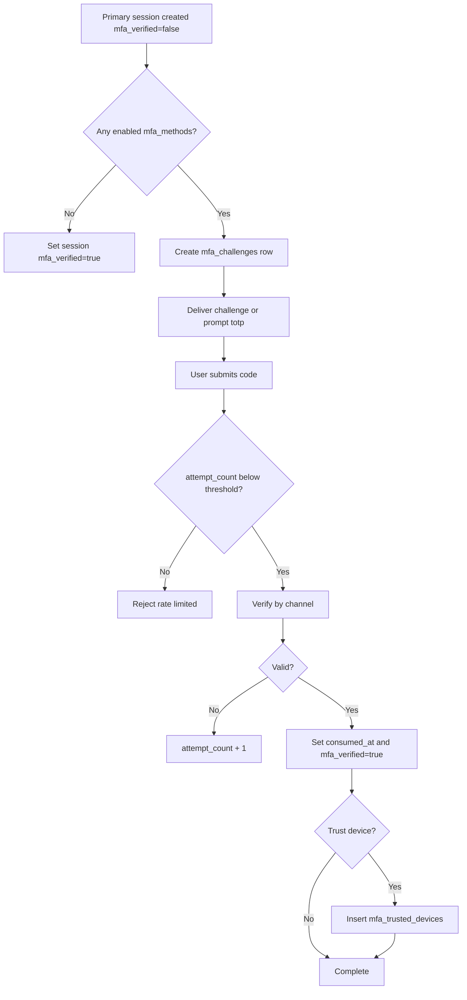
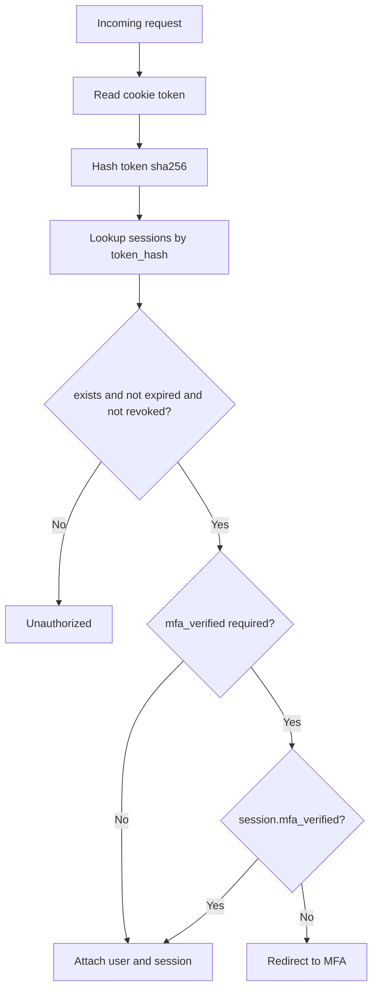
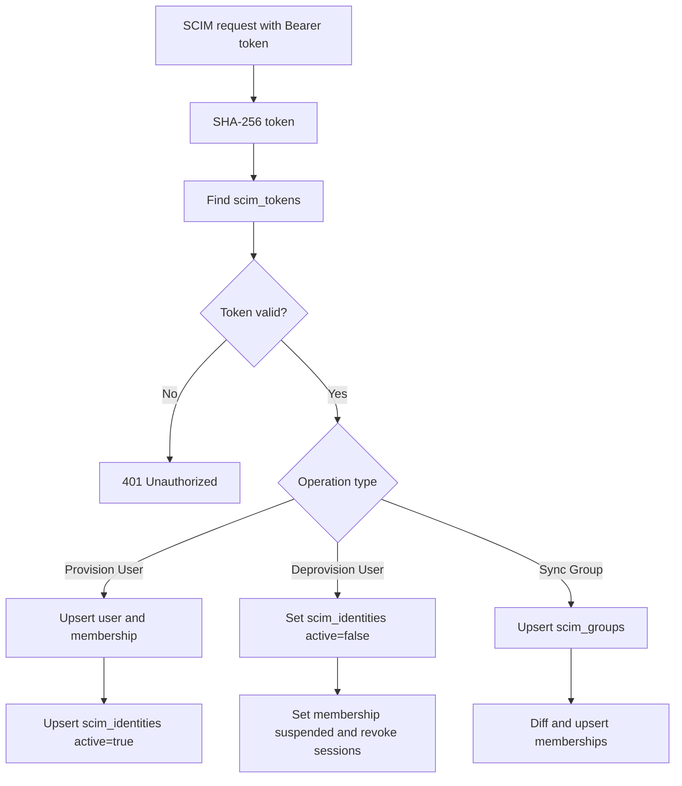

# Auth Schema

這份文件以目前 `app/lib/db/schema/auth/*.ts` 為唯一真實來源，整理：

1. 全部資料表職責
2. 全部 enum 定義與語意
3. 各種登入方式的詳細用法
4. 每種登入方式的詳細流程圖（Mermaid）

支援範圍：
**Password**、**Social OAuth**、**Passkey (WebAuthn/FIDO2)**、**Enterprise SSO (SAML/OIDC)**、**MFA Overlay**、**SCIM**、**Audit Log**。

---

## 1. Schema 分組

| Group       | Tables                                                                                                   |
| ----------- | -------------------------------------------------------------------------------------------------------- |
| Core        | `organizations`, `users`, `user_emails`, `organization_memberships`, `teams`, `team_members`, `sessions` |
| Credentials | `passwords`, `social_oauth_accounts`, `passkeys`                                                         |
| MFA         | `mfa_methods`, `mfa_backup_codes`, `mfa_challenges`, `mfa_trusted_devices`                               |
| SSO         | `sso_connections`, `sso_saml_configs`, `sso_oidc_configs`, `sso_identities`, `sso_organization_domains`  |
| SCIM        | `scim_tokens`, `scim_identities`, `scim_groups`, `scim_group_memberships`                                |
| Utils       | `verification_tokens`                                                                                    |
| Audit       | `audit_logs`                                                                                             |

---

## 2. Enum 字典（完整）

### 2.1 core.ts

| Enum                              | Values                                         | 說明                        |
| --------------------------------- | ---------------------------------------------- | --------------------------- |
| `organizations_status`            | `active`, `suspended`, `archived`              | 組織狀態                    |
| `users_status`                    | `active`, `suspended`, `archived`, `pending`   | 使用者狀態                  |
| `organization_memberships_status` | `active`, `invited`, `suspended`, `removed`    | 使用者在組織內的狀態        |
| `teams_status`                    | `active`, `archived`                           | 團隊狀態                    |
| `team_members_status`             | `active`, `suspended`                          | 團隊成員狀態                |
| `sessions_auth_method`            | `password`, `oauth`, `passkey`, `saml`, `oidc` | 建立該 session 的主登入方式 |

### 2.2 mfa.ts

| Enum                     | Values                                | 說明                      |
| ------------------------ | ------------------------------------- | ------------------------- |
| `mfa_methods_type`       | `totp`, `sms`, `email`                | 使用者可註冊的 MFA 方法   |
| `mfa_challenges_channel` | `totp`, `email`, `sms`, `backup_code` | 當次 challenge 的驗證通道 |

### 2.3 sso.ts

| Enum                            | Values                        | 說明                           |
| ------------------------------- | ----------------------------- | ------------------------------ |
| `sso_connections_status`        | `active`, `disabled`          | SSO 連線是否可用               |
| `sso_connections_provider_type` | `saml`, `oidc`                | SSO 協議類型                   |
| `sso_connections_mfa_policy`    | `inherit`, `required`, `none` | 該 SSO 連線的 MFA 規則覆蓋策略 |

---

## 3. 整體資料模型（關聯圖）

```mermaid
erDiagram
  organizations ||--o{ organization_memberships : has
  users ||--o{ organization_memberships : joins
  organizations ||--o{ teams : owns
  teams ||--o{ team_members : has
  organization_memberships ||--o{ team_members : links

  users ||--o{ user_emails : has
  users ||--o| passwords : has
  users ||--o{ social_oauth_accounts : has
  users ||--o{ passkeys : has

  users ||--o{ sessions : has
  organizations ||--o{ sessions : scoped
  organization_memberships ||--o{ sessions : scoped

  users ||--o{ mfa_methods : enrolls
  users ||--o{ mfa_backup_codes : has
  users ||--o{ mfa_challenges : receives
  sessions ||--o{ mfa_challenges : binds
  mfa_methods ||--o{ mfa_challenges : binds
  users ||--o{ mfa_trusted_devices : trusts
  organizations ||--o{ mfa_trusted_devices : scoped

  organizations ||--o{ sso_connections : has
  sso_connections ||--o| sso_saml_configs : config
  sso_connections ||--o| sso_oidc_configs : config
  sso_connections ||--o{ sso_identities : maps
  users ||--o{ sso_identities : linked
  organizations ||--o{ sso_organization_domains : owns

  organizations ||--o{ scim_tokens : issues
  organizations ||--o{ scim_identities : syncs
  users ||--o{ scim_identities : mapped
  organizations ||--o{ scim_groups : syncs
  scim_groups ||--o{ scim_group_memberships : has
  organization_memberships ||--o{ scim_group_memberships : mapped

  users ||--o{ verification_tokens : has
  organizations ||--o{ audit_logs : has
  users ||--o{ audit_logs : emits
  sessions ||--o{ audit_logs : via
```



---

## 4. 共通登入骨架

所有主登入方式（password/oauth/passkey/saml/oidc）最終都要收斂成同一個 session 建立流程。

1. 取得或建立 `users.id`
2. 視需要綁定 `organization_id` / `organization_membership_id`
3. 產生 `opaque token`（明文只回給 client）
4. 將 `SHA-256(token)` 寫入 `sessions.token_hash`
5. 設定 `sessions.auth_method`
6. 初始化 `sessions.mfa_verified = false`
7. 執行 MFA Overlay，通過後升級為 `true`

```mermaid
flowchart TD
  A[Primary Auth Success] --> B[Resolve user_id]
  B --> C[Create opaque token]
  C --> D[Store sessions.token_hash = SHA-256(token)]
  D --> E[Set sessions.auth_method]
  E --> F[Set mfa_verified = false]
  F --> G{Has enabled MFA method?}
  G -->|No| H[Set mfa_verified = true]
  G -->|Yes| I[Create mfa_challenges]
  I --> J[Verify challenge]
  J --> K{Valid?}
  K -->|Yes| H
  K -->|No| L[Increase attempt_count / reject]
```

---

## 5. 各登入功能詳細用法與流程圖

### 5.1 Password Login

#### 用法

1. 由 `user_emails.email` 找到 `user_id`。
2. 查 `passwords.user_id` 取得 `hash`、`failed_attempts`、`locked_until`。
3. 若 `locked_until > now` 直接拒絕。
4. 執行 Argon2id 驗證。
5. 失敗則更新 `failed_attempts`，必要時設定 `locked_until`。
6. 成功則清零 `failed_attempts`，建立 `sessions`（`auth_method='password'`）。
7. 進入 MFA Overlay。

#### 流程圖



### 5.2 Social OAuth Login

#### 用法

1. 建立 OAuth state 與 PKCE（`code_verifier` / `code_challenge`）。
2. 使用者授權後，callback 端驗證 state。
3. 以 authorization code 換 token，驗證 `id_token`。
4. 取 provider 的穩定識別（`sub`）對應到 `social_oauth_accounts.provider_subject`。
5. 若找不到既有綁定，依 email 決定連到現有 user 或建立新 user。
6. 寫入或更新 `social_oauth_accounts`（token 欄位需加密儲存）。
7. 建立 `sessions`（`auth_method='oauth'`）後進入 MFA Overlay。

#### 流程圖

```mermaid
flowchart TD
  A[User clicks OAuth login] --> B[Generate state + PKCE]
  B --> C[Redirect to provider]
  C --> D[Callback with code + state]
  D --> E{State valid?}
  E -->|No| F[Reject]
  E -->|Yes| G[Exchange code for tokens]
  G --> H[Verify id_token/JWKS]
  H --> I[Read provider_subject(sub)]
  I --> J{social_oauth_accounts exists?}
  J -->|Yes| K[Load linked user]
  J -->|No| L[Find/create user, then link provider]
  K --> M[Create session auth_method=oauth]
  L --> M
  M --> N[MFA overlay]
```

### 5.3 Passkey Login (WebAuthn)

#### 用法

Passkey 分註冊與登入兩段。

1. 註冊：伺服器發 challenge，客戶端 `navigator.credentials.create()`，伺服器驗證後寫入 `passkeys`。
2. 登入：伺服器發 challenge，客戶端 `navigator.credentials.get()`，伺服器驗章與 counter。
3. 驗證成功後更新 `passkeys.sign_count`、`passkeys.last_used_at`。
4. 建立 `sessions`（`auth_method='passkey'`）並進入 MFA Overlay（若策略要求）。

#### 流程圖（註冊）



#### 流程圖（登入）



### 5.4 Enterprise SSO Login - SAML

#### 用法

1. 先依 org 或 email domain 找對應 `sso_connections(provider_type='saml')`。
2. 讀 `sso_saml_configs` 產生 AuthnRequest 並轉導 IdP。
3. callback 收到 SAMLResponse 後驗章與條件（audience/time window/destination）。
4. 萃取 NameID 作為 `sso_identities.subject`。
5. 若無對應 identity，依 `jit_enabled` 決定是否自動建 user。
6. 建立 `sessions`（`auth_method='saml'`）並進入 MFA Overlay（依 `mfa_policy`）。

#### 流程圖



### 5.5 Enterprise SSO Login - OIDC

#### 用法

1. 依 org 或 domain 找 `sso_connections(provider_type='oidc')`。
2. 讀 `sso_oidc_configs`，取 discovery 文件與 JWKS。
3. 建立 `state + nonce + PKCE` 後導向授權端點。
4. callback 驗證 state，換 token，驗證 `id_token`。
5. 取 `sub` 作為 `sso_identities.subject`。
6. identity 不存在時，依 `jit_enabled` 決定是否建 user。
7. 建立 `sessions`（`auth_method='oidc'`）並進入 MFA Overlay（依 `mfa_policy`）。

#### 流程圖



---

## 6. MFA Overlay 詳細流程

### 用法

1. 主登入成功後，讀 `mfa_methods` 取得 `enabled=true` 的方法。
2. 沒有方法則直接設 `sessions.mfa_verified=true`。
3. 有方法則建立 `mfa_challenges`，記錄 `channel`、`expires_at`、`attempt_count`。
4. TOTP 直接驗 secret；Email/SMS 用 `code_hash` 比對；備援碼比對 `mfa_backup_codes.code_hash`。
5. 成功後設 `mfa_challenges.consumed_at` 與 `sessions.mfa_verified=true`。
6. 選擇信任裝置時，寫入 `mfa_trusted_devices`。

### 流程圖



---

## 7. Session 管理

### 用法

1. Cookie 取 token 明文。
2. 伺服器計算 `SHA-256(token)` 對 `sessions.token_hash`。
3. 檢查 `expires_at`、`revoked_at`。
4. `sessions.auth_method` + `sessions.mfa_verified` 決定授權層級。
5. 登出或風險事件時更新 `revoked_at`（不硬刪除）。

### 流程圖



---

## 8. SCIM（佈建/停用）

### 用法

1. middleware 將 bearer token 做 SHA-256，對應 `scim_tokens.token_hash`。
2. 建立帳號時，寫入 `scim_identities(active=true)` 與 `organization_memberships`。
3. 停用時，將 `scim_identities.active=false`、`organization_memberships.status='suspended'`，並撤銷該組織相關 session。
4. 群組同步使用 `scim_groups` 與 `scim_group_memberships`。

### 流程圖



---

## 9. 安全決策重點

1. Token 一律存 hash。
2. OAuth refresh token、OIDC client secret、TOTP secret 一律加密存放。
3. 安全資料採 soft revoke / soft deactivate，避免破壞稽核軌跡。
4. `provider_subject` / `subject` 一律作為外部身分連結主鍵，不用 email 當唯一識別。
5. Passkey 使用 `sign_count` 偵測複製風險。
6. MFA 以 `sessions.mfa_verified` 收斂，讓 middleware 判斷邏輯一致。

---

## 10. 檔案對照

| File             | Role                                       |
| ---------------- | ------------------------------------------ |
| `core.ts`        | 多租戶核心、membership、session            |
| `credentials.ts` | password、social oauth、passkey            |
| `mfa.ts`         | MFA 方法、挑戰、信任裝置                   |
| `sso.ts`         | 企業 SSO 連線與身分映射                    |
| `scim.ts`        | IdP 自動佈建與群組同步                     |
| `utils.ts`       | 驗證 token（驗證信箱/重設密碼/magic link） |
| `audit.ts`       | append-only 安全事件日誌                   |
